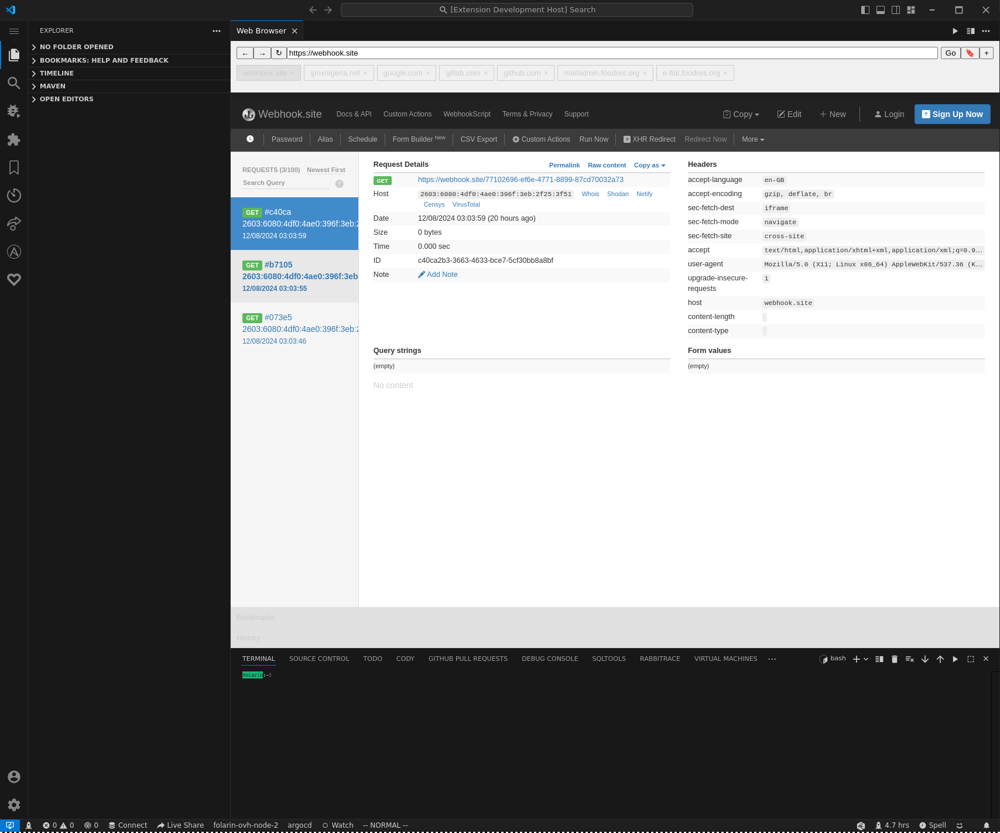
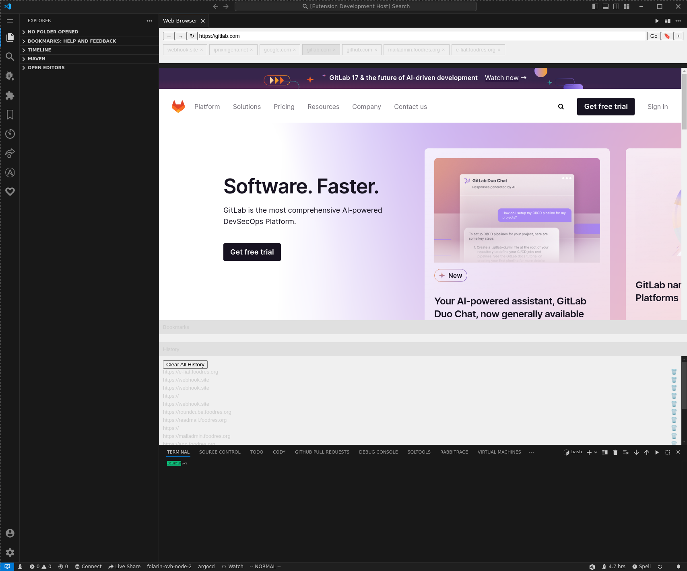

<!-- @format -->

# VSCode Web Browser Extension

A powerful Visual Studio Code extension that integrates a full-featured web browser directly within your editor. This extension is perfect for developers who need to browse the web, research, or test web pages without leaving their coding environment.

## Features

-   **Integrated Web Browser**: Open a web browser directly within VSCode.
-   **Multi-tab**: Open multiple tabs, and view your favorite pages by switching between tabs
-   **Browsing History**: Automatically save your browsing history and retrieve it anytime.
-   **Bookmark Management**: Save, retrieve, and manage bookmarks for quick access to your favorite web pages.
-   **Persistent State**: The webview context is retained even when hidden, and upon vscode restarts, ensuring you don't lose your work.
-   **Script Execution**: Enables the execution of scripts within the webview, providing a full browsing experience.

## Screenshots

## Installation

1. Open Visual Studio Code.
2. Go to the Extensions view by clicking on the Extensions icon in the Activity Bar on the side of the window.
3. Search for `vscode-web-browser`.
4. Click **Install** to install the extension.
5. Once installed, use the `vscode-browser.openBrowser` command to launch the web browser.

Alternatively, you can install the extension from the [VSCode Marketplace](https://marketplace.visualstudio.com/items?itemName=mfolarin.mfolarin-vscode-web-browser).

## Usage

1. Press `Ctrl+Shift+P` to open the Command Palette.
2. Type `Open Browser` and select `vscode-browser.openBrowser` from the list.
3. The web browser will open in a new panel. You can start browsing immediately.
4. To save a bookmark, click the bookmark icon in the webview toolbar.
5. To view your bookmarks or history, use the respective icons or commands.

## Known Issues

-   **Performance**: The webview may experience performance issues with very complex or resource-intensive web pages.
-   **Limited Browser Features**: This is not a full-fledged browser and lacks some features like extensions or developer tools.
-   **No Session Handling**: Pages with session-handling tokens may not render properly
-   **Bookmarks not saving**: Bookmarks collection is currently not being properly populated

## Change log

-   1.0.3 added product icon
-   1.0.2 Initial release

## Roadmap and Future Features

-   **Improved Performance**: Optimization to handle more complex web pages smoothly.
-   **Enhanced Bookmarking**: Organize bookmarks into folders and add tags for better management.
-   **Session Management**: Allow users to log in to secure websites and manage tokens and headers
-   **Customizable UI**: Themes and layout customizations for a more personalized experience.
-   **VS Code links integration**: Enable extension to handle vs code links instead of opening system browser

## Contributing

Contributions are welcome! To contribute:

1. Fork the repository from [GitHub](https://github.com/folarinmartins/vscode-web-browser).
2. Create a new branch (`git checkout -b feature/your-feature-name`).
3. Make your changes.
4. Commit your changes (`git commit -m 'Add some feature'`).
5. Push to the branch (`git push origin feature/your-feature-name`).
6. Open a Pull Request.

Please ensure that your code adheres to the coding standards and includes appropriate tests.

## License

This project is licensed under the MIT License. See the [LICENSE](LICENSE) file for details.
